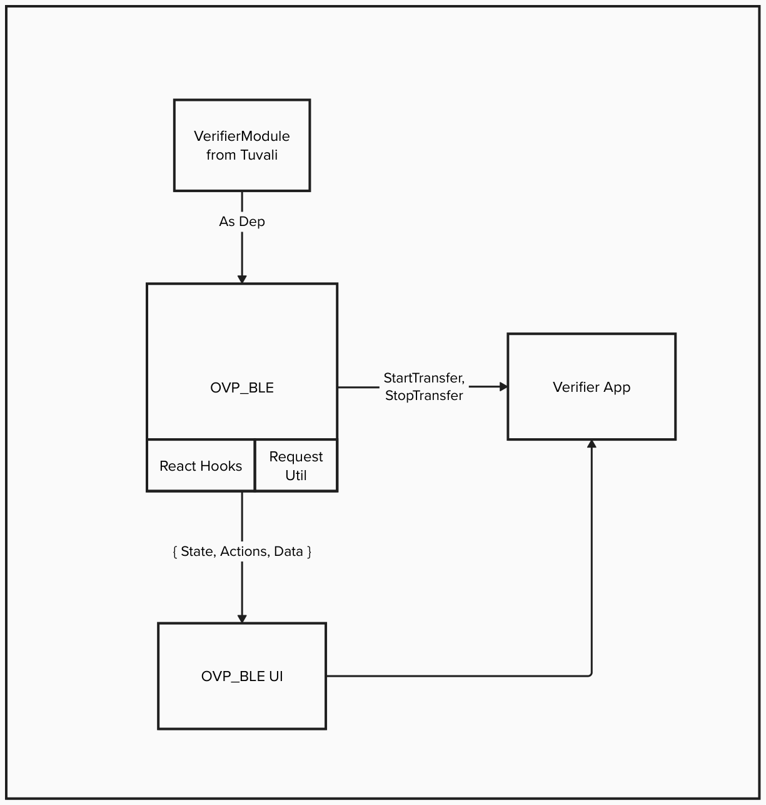

## UI Implementation
This documentation describes the internal APIs which can be used to build custom UI screens.


## Architecture for OVP-BLE
 

 As shown in the architecture diagram above, the `ovp-ble` sdk provides intermediate states, actions and data under **`UI`** variable. You can find the details on the same below.

## UI API for Verifier app

 Following are possible states ordered based on the flow.

 
| **State**                     | **Actions**                      | **data**           |
|-------------------------------|----------------------------------|--------------------|
| Idle                          | startAdvertising                 | -                  |
| Advertising                   | stopAdvertising                  | {uri: string}      |
| Connected                     | disconnect                       | -                  |
| Secure Connection Established | sendRequest(Request), disconnect | -                  |
| Requesting                    | disconnect                       | {request}          |
| Requested                     | disconnect                       | -                  |
| Receiving                     | disconnect                       | {progress: number} |
| Received                      | disconnect                       | { vc }             |
| Error                         | disconnect (Optional)            | { error }          |


The structure of the UI variable is,
```
{
  name: string;
  data: object;
  actions: {ACTION: funtion};
}
```

1. `name` : The name  of the current state. Tha values can be,
    * `Idle`
    * `Advertising`
    * `Connected`
    * `SecureConnectionEstablished`
    * `Requested`
    * `Received`
    * `Error` 
    * `Disconnected`

2. `data`: This is an optional field that contains the current states data.
3. `actions`: This is object of funtions as shown in the table above.

#### Example state
```
{
  name: 'Advertising',
  data: {uri : "OPENID4VP://connect?name=STADONENTRY&key=8520f0098930a754748b7ddcb43ef75a0dbf3a0d26381af4eba4a98eaa9b4e6a"},
  actions: { stopAdvertising }
}
```
